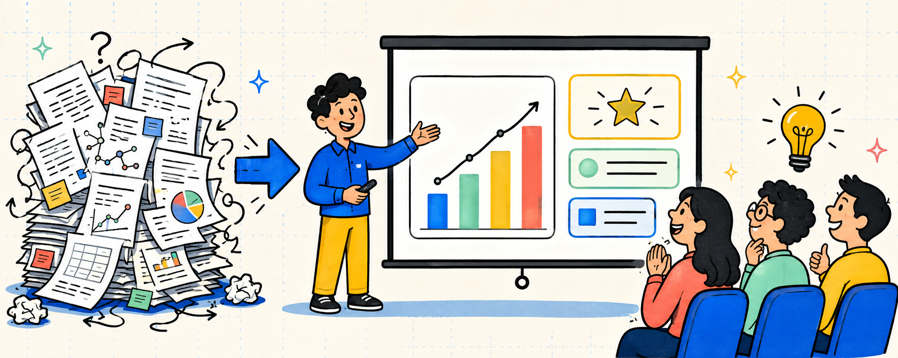

<p align="center">
  
</p>

<h1 align="center">🎤 Paper Presentation Tips</h1>

<p align="center">
  <a href="https://github.com/lishasha2001/Paper-Presentation-Tips">
    
  </a>
  <a>
    
  </a>
  <a>
    
  </a>
  <a href="https://github.com/lishasha2001/Paper-Presentation-Tips/stargazers">
    
  </a>
  <a href="https://github.com/lishasha2001/Paper-Presentation-Tips/network/members">
    
  </a>
  <a href="https://github.com/lishasha2001/Paper-Presentation-Tips/issues">
    
  </a>
</p>

<p align="center">
  <b>面向论文汇报与学术展示的 Slides 设计与表达指南</b>
</p>

<p align="center">
  <a href="#-项目动机">💡 项目动机</a> •
  <a href="#-presentation-tips">🎯 Presentation Tips</a> •
  <a href="#-资源合集">📖 资源合集</a> •
  <a href="#-组织者列表">👥 组织者列表</a> •
  <a href="#-欢迎贡献">🤝 欢迎贡献</a> •
  <a href="#acknowledgements">🙏 Acknowledgements</a>
</p>

<br/>

---

<p align="center">
  <b>Good Presentation = Clear Message + Clear Visuals + Clear Story</b><br/>
  <b>信息清晰 · 视觉清晰 · 叙事清晰</b>
</p>

---

<br/>

## 💡 项目动机

> **论文汇报不是把论文内容直接“搬到 PPT 上”，而是面向听众重新组织信息。**

论文阅读和论文汇报对应着两种不同的信息接收方式。

论文允许读者停下来、回看公式、反复理解细节；而在 Presentation 中，听众只能跟随讲者的节奏，在有限时间内持续接收信息。因此，一份好的 Presentation Slides 不应该只是论文内容的压缩版，而应该围绕听众的理解过程重新组织。

在论文汇报中，我们经常遇到这些问题：

- 页面信息过载或重点不突出，听众难以快速抓住核心内容；
- 方法和实验展示过于复杂，听众难以建立直觉、理解结论；
- 汇报结束后，听众仍然说不清这项工作的核心贡献；
- ……

这个项目希望从真实的 Paper Presentation 场景出发，总结一组简单、可操作、可复用的经验，并通过 Bad Slide / Good Slide 的对比方式展示这些原则如何真正落到一页 Slides 上。

<div align="center">

<table>

<tr>
  <th width="22%">组成</th>
  <th width="78%">说明</th>
</tr>

<tr>
  <td align="center"><b>常见问题</b></td>
  <td>Paper Presentation 中经常出现、但容易被忽略的表达问题 </td>
</tr>

<tr>
  <td align="center"><b>❌ Bad Slide</b></td>
  <td>
    展示一种常见但不够理想的 Slides 设计方式，用于帮助理解问题所在 <br/>
    <b>（这些示例仅基于我们的粗浅理解与有限实践，并非唯一标准）</b>
  </td>
</tr>

<tr>
  <td align="center"><b>✅ Good Slide</b></td>
  <td>
    在保持原始信息和研究内容的基础上，展示一种更清晰的组织与表达方式
  </td>
</tr>

<tr>
  <td align="center"><b>💡 Core Principle</b></td>
  <td>
    提炼出的可迁移的 Paper Presentation 设计原则
  </td>
</tr>

</table>

</div>

<details>
<summary><b>⚠️ 免责声明</b></summary>

<br/>

本项目中的 Bad Slide / Good Slide 对比主要用于帮助说明具体的 Presentation 设计原则。
这些示例来自我们有限的论文汇报实践与个人经验，并不意味着存在唯一正确的 Slides 设计方式。


不同研究方向、汇报场景、听众背景与时间限制，都可能对应不同的最佳表达方式。

因此，这些 Tips 是作为设计和思考时的参考，而不是必须遵守的规则。

最后，如果你有不同的经验、案例或观点，也非常欢迎通过 Issue 或 Pull Request 参与讨论与补充。

</details>

<br/>

---

<a id="-presentation-tips"></a>

## 🎯 Presentation Tips

<div align="center">

<table width="100%">

<tr>
  <th width="28%">Part</th>
  <th width="72%">Tips · 描述</th>
</tr>

<tr>
  <td align="center" valign="middle" nowrap>
    🎨 <b>Part A · 整体设计与表达</b>
  </td>
  <td align="center" valign="middle" nowrap>
    <b>Tips 1–5</b> · 聚焦 Slides 的信息组织、单页表达、标题、颜色与排版等基础问题
  </td>
</tr>

<tr>
  <td align="center" valign="middle" nowrap>
    💡 <b>Part B · 背景与动机</b>
  </td>
  <td align="center" valign="middle" nowrap>
    <b>Tip 6</b> · 如何帮助听众快速建立问题直觉，并理解“为什么值得研究”
  </td>
</tr>

<tr>
  <td align="center" valign="middle" nowrap>
    🧩 <b>Part C · 方法介绍</b>
  </td>
  <td align="center" valign="middle" nowrap>
    <b>Tips 7–8</b> · 如何降低复杂方法的理解门槛，清晰表达工作的核心创新
  </td>
</tr>

<tr>
  <td align="center" valign="middle" nowrap>
    📊 <b>Part D · 实验分析</b>
  </td>
  <td align="center" valign="middle" nowrap>
    <b>Tips 9–10</b> · 如何突出关键实验结果，让听众快速理解实验结论
  </td>
</tr>

<tr>
  <td align="center" valign="middle" nowrap>
    🎯 <b>Part E · 总结收尾</b>
  </td>
  <td align="center" valign="middle" nowrap>
    <b>Tip 11</b> · 如何在报告结束时回顾核心内容，强化听众的最后印象
  </td>
</tr>

</table>

</div>

---

<a id="general-design"></a>

### 🎨 Part A · 整体设计与表达

<blockquote>
聚焦论文汇报中最基础的信息组织与视觉表达问题，让每一页 Slides 都更清晰、更容易理解。
</blockquote>

<br/>

<details open>
<summary><b>Tip 1: 每页字数不要太多</b></summary>

<br/>

<p align="center">
  
</p>

</details>

<details>
<summary><b>Tip 2: 一页只承担一个核心任务</b></summary>

<br/>

<p align="center">
  
</p>

</details>

<details>
<summary><b>Tip 3: 标题要有意义</b></summary>

<br/>

<p align="center">
  
</p>

</details>

<details>
<summary><b>Tip 4: 颜色不要太多太乱</b></summary>

<br/>

<p align="center">
  
</p>

</details>

<details>
<summary><b>Tip 5: 注意排版细节</b></summary>

<br/>

<p align="center">
  
</p>

</details>

<p align="right"><a href="#-presentation-tips">⬆️ 返回 Tips 目录</a></p>

---

<a id="motivation"></a>

### 💡 Part B · 背景与动机

<blockquote>
聚焦如何从具体问题出发建立研究动机，让听众先理解“为什么”，再进入抽象概念与任务定义。
</blockquote>

<br/>

<details open>
<summary><b>Tip 6: 用案例引出问题，而不是先讲抽象定义</b></summary>

<br/>

<p align="center">
  
</p>

</details>

<p align="right"><a href="#-presentation-tips">⬆️ 返回 Tips 目录</a></p>

---

<a id="method"></a>

### 🧩 Part C · 方法介绍

<blockquote>
聚焦如何解释复杂的方法与技术细节，在保持严谨性的同时降低听众的理解门槛。
</blockquote>

<br/>

<details open>
<summary><b>Tip 7: 先讲例子，再讲公式</b></summary>

<br/>

<p align="center">
  
</p>

</details>

<details>
<summary><b>Tip 8: 用精炼的语言阐述创新点</b></summary>

<br/>

<p align="center">
  
</p>

</details>

<p align="right"><a href="#-presentation-tips">⬆️ 返回 Tips 目录</a></p>

---

<a id="experiments"></a>

### 📊 Part D · 实验分析

<blockquote>
聚焦如何展示实验结果、突出关键发现，并让听众快速理解“实验说明了什么”。
</blockquote>

<br/>

<details open>
<summary><b>Tip 9: 让听众一眼看到重点</b></summary>

<br/>

<p align="center">
  
</p>

</details>

<details>
<summary><b>Tip 10: 实验部分多用图，少用表格</b></summary>

<br/>

<p align="center">
  
</p>

</details>

<p align="right"><a href="#-presentation-tips">⬆️ 返回 Tips 目录</a></p>

---

<a id="summary"></a>

### 🎯 Part E · 总结收尾

<blockquote>
聚焦如何在论文汇报结束时重新强化任务、方法、实验结果与核心结论，让听众带着最重要的信息离场。
</blockquote>

<br/>

<details open>
<summary><b>Tip 11: 在总结页回顾核心内容，强化最后印象</b></summary>

<br/>

<p align="center">
  
</p>

</details>

<p align="right"><a href="#-presentation-tips">⬆️ 返回 Tips 目录</a></p>

<br/>

---

## 📖 资源合集

> 持续整理与 Paper Presentation、Academic Talk 和 Slides 设计相关的优秀资料。

### 🎬 视频 / 课程资源

<div align="center">

| # | 资源 | 简介 |
|:---:|---|---|
| 1 | [Designing Effective Scientific Presentations](https://www.ibiology.org/professional-development/scientific-presentations/) — Susan McConnell, Stanford / iBiology | 科研 Slides 的字体、颜色、布局、数据展示与整体结构 |
| 2 | [Oral Presentations: Using Slides Effectively](https://www.ibiology.org/nrmn-resources/oral-presentations-using-slides-effectively/) — Boyd Branch | 如何基于视觉层级与信息简化，制作清晰易懂的 Slides |
| 3 | [Share Your Research: How to Give a Good Talk](https://www.ibiology.org/educators-resources/online-course/share-your-research/) — iBiology | 一套系统的科研汇报课程，涵盖 Slides 设计 |
| 4 | [Rethinking Scientific Presentations: Slide Design and Delivery](https://www.ibiology.org/professional-development/power-point-slide-design/) — Michael Alley | 如何用结论式标题和视觉证据组织 Slides |

</div>

### 🌍 经验分享

<div align="center">

| # | 资源 | 简介 |
|:---:|---|---|
| 1 | [Ten Simple Rules for Effective Presentation Slides](https://journals.plos.org/ploscompbiol/article?id=10.1371/journal.pcbi.1009554) — PLOS Computational Biology | 科研 Slides 设计的十条核心原则 |
| 2 | [Some Rules for Making a Presentation](https://www.cs.cmu.edu/~mihaib/presentation-rules.html) — Mihai Budiu | 科研 Presentation 的实用经验 |
| 3 | [Dos and Don'ts for Research Presentations](https://maartensap.com/notes/03-presenting-your-research.html) — Maarten Sap | 研究型 Presentation 中常见的问题与改进方式 |
| 4 | [Creating Effective Presentation Slides](https://academics.umw.edu/swc/resources/) — University of Mary Washington | 高效 Presentation Slides 的基本设计原则 |
| 5 | [Presentation Accessibility Checklist](https://academics.umw.edu/swc/resources/) — University of Mary Washington | 从字体、颜色、对比度、图像和结构等方面检查 Slides |

</div>

### 🛠️ 工作流与 Skills

<div align="center">

| # | 项目 | 功能 / 亮点 |
|:---:|---|---|
| 1 | [PPT Master](https://github.com/hugohe3/ppt-master) | 从主题、文档或已有模板生成原生可编辑 PPTX |
| 2 | [powerpoint-skills](https://github.com/wdempsey/powerpoint-skills) | 学术 Slides 综合 Skill Suite |
| 3 | [Paper2Slides](https://github.com/HKUDS/Paper2Slides) | 将论文或长文档自动转化为结构化 Slides |
| 4 | [Scholar Slides](https://github.com/luwill/research-skills/blob/main/scholar-slides/SKILL.md) | 强调学术内容保真与证据可追溯的 Slides 生成工作流 |
| 5 | [Beamer Academic](https://github.com/Faust-Donf/beamer-academic/blob/main/SKILL.md) | 从论文内容自动生成并迭代 Beamer Slides |
| 6 | [Extract PPTX Template](https://github.com/jiandong01/pptx-skills/blob/main/extract-template/SKILL.md) | 从已有 PPT 中提取并复用模板样式 |
| 7 | [PPT Speech Writer](https://github.com/AI272/speaker/blob/main/ppt-speech-writer/SKILL.md) | 为 PPT 逐页生成讲稿，并进行汇报时间规划 |
| 8 | [Markdown Slide Decks](https://github.com/borghei/Claude-Skills/blob/main/markdown-html/md-slides/SKILL.md) | 将 Markdown 转换为可直接浏览的 HTML Slides |
| 9 | [HTML Presentation Skill](https://github.com/wbohanw/html-presentation/blob/main/SKILL.md) | 制作可直接浏览与分享的 HTML Presentation 页面 |

</div>

<br/>

---

## 👥 组织者列表

<p align="left">
  <b>感谢以下成员对本项目进行组织与指导</b>
</p>

<p align="left">
  <a href="https://github.com/lishasha2001">
    </a>
  &nbsp;&nbsp;
  <a href="https://github.com/chenyuanTKCY">
    </a>
  &nbsp;&nbsp;
  <a href="https://github.com/YanyuYao1">
    </a>
  &nbsp;&nbsp;
  <a href="https://github.com/hiki1op">
    </a>
  &nbsp;&nbsp;
  <a href="https://github.com/xcGH-stu">
    </a>
  &nbsp;&nbsp;
    <a href="https://github.com/figureout2024">
    </a>
  &nbsp;&nbsp;
    <a href="https://github.com/Xyzjx">
    </a>
  &nbsp;&nbsp;
  <a href="https://github.com/zhengzhi-1997">
    </a>
  &nbsp;&nbsp;
  <a href="https://github.com/qinlibo-hit">
    </a>
</p>

<br/>

---

## 🤝 欢迎贡献

欢迎通过 **Issue** 或 **PR** 补充更多 Paper Presentation Tips、真实的 Bad / Good Slide 示例以及相关资源。

论文汇报本身没有唯一正确的模板。我们希望这个项目能够不断汇集不同研究者的实践经验，帮助大家用更清晰、更有效的方式表达自己的研究。

<details>
<summary><b>📝 建议新增内容时保持以下结构</b></summary>

<br/>

```text
<Tip 标题>

常见问题：...

❌ Bad Slide：...

✅ Good Slide：...

💡 Core Principle：...
```

</details>

<br/>

---

<a id="acknowledgements"></a>

## 🙏 Acknowledgements

本项目在组织形式、内容呈现与 README 设计上参考了以下优秀开源项目：

- [Paper-Rebuttal-Tips](https://github.com/MLNLP-World/Paper-Rebuttal-Tips) — 面向学术论文 Rebuttal 的经验总结与实践指南
- [Academic-Poster-Template](https://github.com/MLNLP-World/Academic-Poster-Template) — 面向科研展示的开源学术海报模板与 README 设计参考

感谢所有为科研写作、学术交流与 Paper Presentation 分享经验的研究者和社区贡献者。
