<h1 align="center">Research Presentation Tips</h1>

<p align="center">
  
  
  
  
</p>

<p align="center">
  <b>面向科研汇报、学术展示与论文分享的 PPT 设计与表达指南</b>
</p>

<p align="center">
  <a href="#-项目动机">项目动机</a> •
  <a href="#-presentation-tips">Presentation Tips</a> •
  <a href="#-资源合集">资源合集</a> •
  <a href="#-组织者列表">组织者列表</a> •
  <a href="#-欢迎贡献">欢迎贡献</a>
</p>

<br/>

---

<p align="center">
  <b>Good Presentation = Clear Message + Clear Visuals + Clear Story</b><br/>
  <b>信息清晰 · 视觉清晰 · 叙事清晰</b>
</p>

---

## 💡 项目动机

> **科研汇报不是把论文“搬到 PPT 上”**，而是重新组织信息，让听众在有限时间内理解问题、方法、结果与核心贡献。

在实际的学术汇报中，我们经常会遇到一些常见问题：单页信息过载、主线不清、标题缺乏重点、方法介绍过于抽象、实验结果难以快速理解，以及总结页没有留下清晰的核心结论。

本项目希望整理一套实用、直观的 **Research Presentation Tips**，覆盖从整体设计与表达、背景与动机、方法介绍，到实验分析与总结收尾的完整科研汇报流程。

与单纯罗列 PPT 设计原则不同，我们希望尽可能通过 **Bad Slide → Good Slide** 的方式展示科研汇报中的常见问题以及更推荐的表达方式，让每一条建议都能够直接应用到真实的 Presentation 中。

每个 Tip 主要由以下几个部分组成：

<div align="center">

| 组成部分 | 说明 |
| --- | --- |
| **常见问题** | 科研汇报中常见的 PPT 展示问题 |
| **❌ Bad Slide** | 容易增加理解成本的展示方式 |
| **✅ Good Slide** | 更清晰、更有效的展示方式 |
| **💡 Core Principle** | 对该 Tip 的核心原则总结 |

</div>

<details>
<summary><b>⚠️ 免责声明</b></summary>

<br/>

本项目中的所有 Tips 主要来源于科研汇报实践经验，**仅供参考**，并非适用于所有场景的绝对规则。

不同研究领域、报告类型、汇报时间和听众背景可能需要不同的呈现方式。例如，Conference Talk、Group Meeting、Thesis Defense 和 Tutorial 对信息密度、技术细节以及讲述节奏的要求并不完全相同。

请根据具体的汇报场景灵活调整。

本项目仍在持续完善中。如果你有不同的经验、优秀的 Presentation 示例，或者对现有 Tips 有任何建议，欢迎提交 Issue 或 PR。

</details>

---

## 📚 Presentation Tips

<div align="center">
<table>
<tr>

<td width="33%" align="center">

### 🎨 整体设计与表达
**Tips 1–5**

<sub>聚焦科研 PPT 的信息组织、单页表达、标题、颜色与排版等基础问题</sub>

</td>

<td width="33%" align="center">

### 💡 背景与动机
**Tip 6**

<sub>聚焦如何帮助听众快速建立问题直觉，并理解“为什么值得研究”</sub>

</td>

<td width="33%" align="center">

### 🧩 方法介绍
**Tips 7–8**

<sub>聚焦如何降低复杂方法的理解门槛，并清晰表达工作的核心创新</sub>

</td>

</tr>

<tr>

<td width="50%" align="center" colspan="1">

### 📊 实验分析
**Tips 9–10**

<sub>聚焦如何突出关键实验结果，并让听众快速理解实验结论</sub>

</td>

<td width="50%" align="center" colspan="2">

### 🎯 总结收尾
**Tip 11**

<sub>聚焦如何在报告结束时回顾核心内容，并强化听众的最后印象</sub>

</td>

</tr>
</table>
</div>

---

<a id="general-design"></a>

### 🎨 整体设计与表达

<blockquote>
聚焦科研汇报中最基础的信息组织与视觉表达问题，让每一页 PPT 都更清晰、更容易理解。
</blockquote>

<br/>

<details open>
<summary><b>Tip 1: 每页字数不要太多</b></summary>

<br/>

<p align="center">
  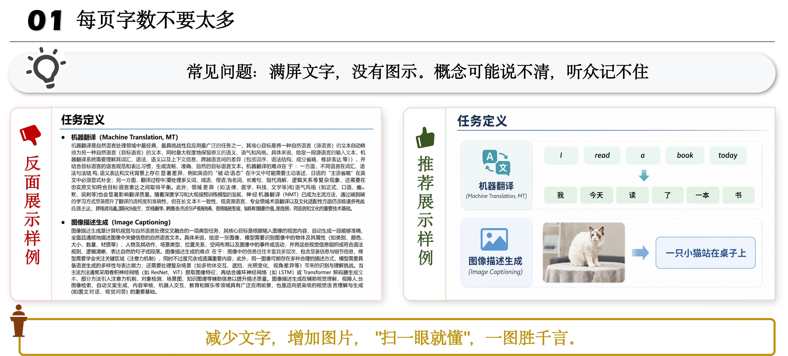
</p>

</details>

<details>
<summary><b>Tip 2: 一页只承担一个核心任务</b></summary>

<br/>

<p align="center">
  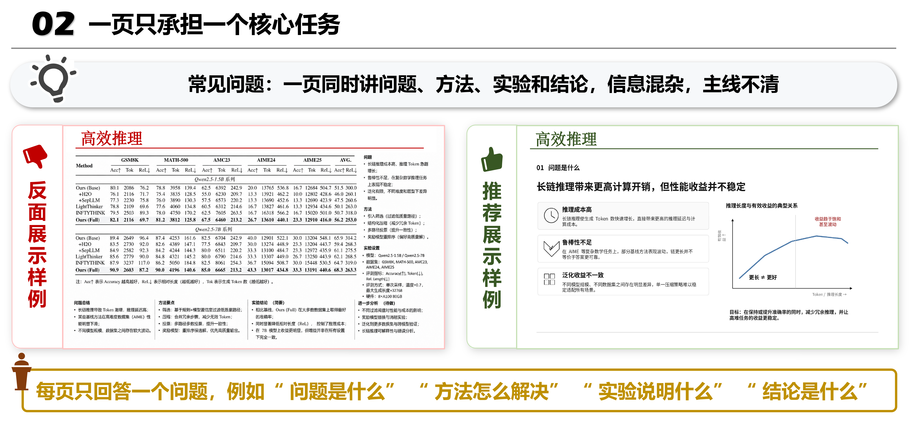
</p>

</details>

<details>
<summary><b>Tip 3: 标题要有意义</b></summary>

<br/>

<p align="center">
  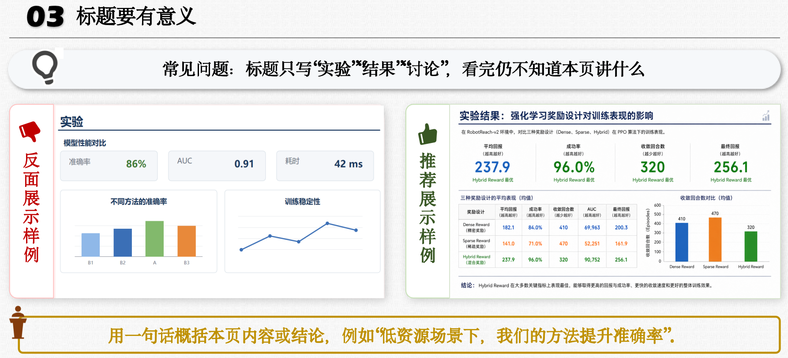
</p>

</details>

<details>
<summary><b>Tip 4: 颜色不要太多太乱</b></summary>

<br/>

<p align="center">
  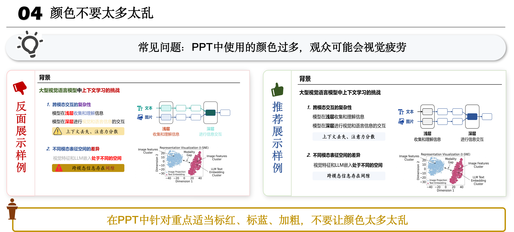
</p>

</details>

<details>
<summary><b>Tip 5: 注意排版细节</b></summary>

<br/>

<p align="center">
  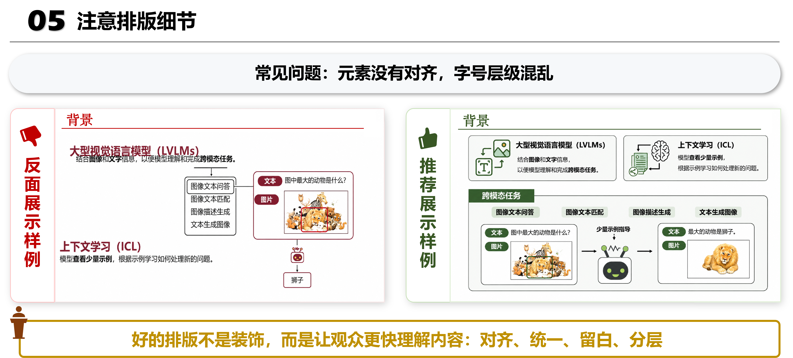
</p>

</details>

<p align="right"><a href="#-presentation-tips">⬆️ 返回 Tips 目录</a></p>

---

<a id="background-motivation"></a>

### 💡 背景与动机

<blockquote>
聚焦如何从具体问题出发建立研究动机，让听众先理解“为什么”，再进入抽象概念与任务定义。
</blockquote>

<br/>

<details open>
<summary><b>Tip 6: 用案例引出问题，而不是先讲抽象定义</b></summary>

<br/>

<p align="center">
  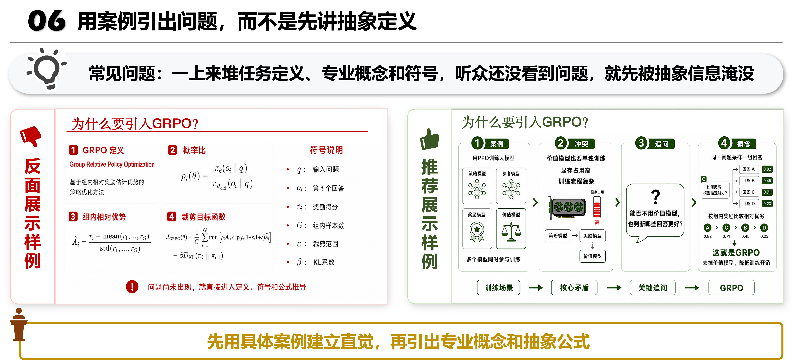
</p>

</details>

<p align="right"><a href="#-presentation-tips">⬆️ 返回 Tips 目录</a></p>

---

<a id="method-presentation"></a>

### 🧩 方法介绍

<blockquote>
聚焦如何解释复杂的方法与技术细节，在保持严谨性的同时降低听众的理解门槛。
</blockquote>

<br/>

<details open>
<summary><b>Tip 7: 先讲例子，再讲公式</b></summary>

<br/>

<p align="center">
  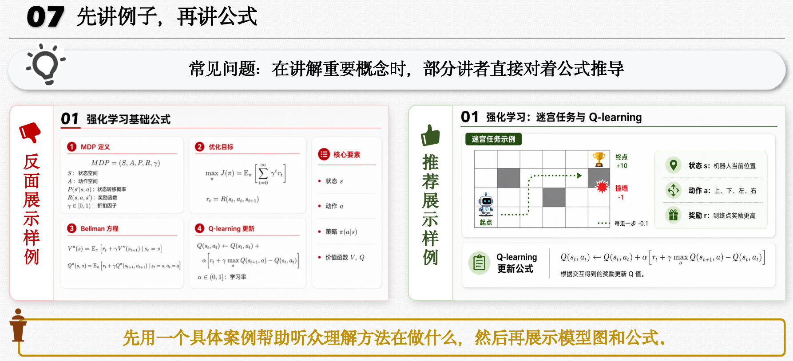
</p>

</details>

<details>
<summary><b>Tip 8: 用精炼的语言阐述创新点</b></summary>

<br/>

<p align="center">
  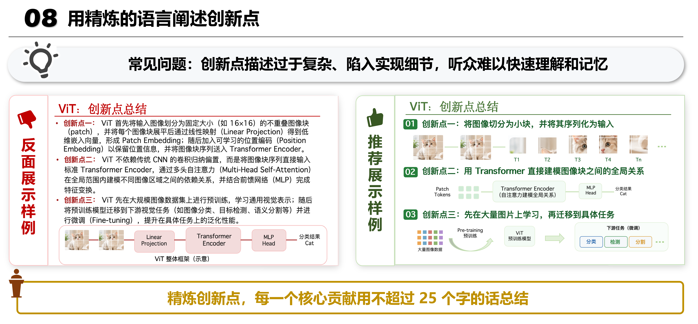
</p>

</details>

<p align="right"><a href="#-presentation-tips">⬆️ 返回 Tips 目录</a></p>

---

<a id="experimental-analysis"></a>

### 📊 实验分析

<blockquote>
聚焦如何展示实验结果、突出关键发现，并让听众快速理解“实验说明了什么”。
</blockquote>

<br/>

<details open>
<summary><b>Tip 9: 让听众一眼看到重点</b></summary>

<br/>

<p align="center">
  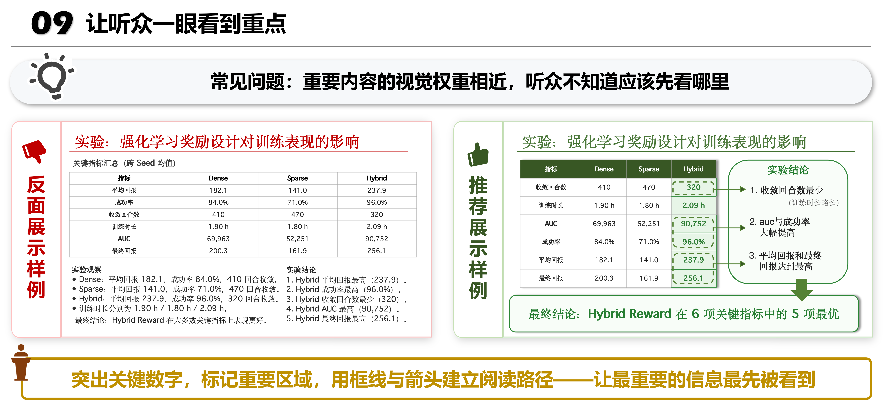
</p>

</details>

<details>
<summary><b>Tip 10: 实验部分多用图，少用表格</b></summary>

<br/>

<p align="center">
  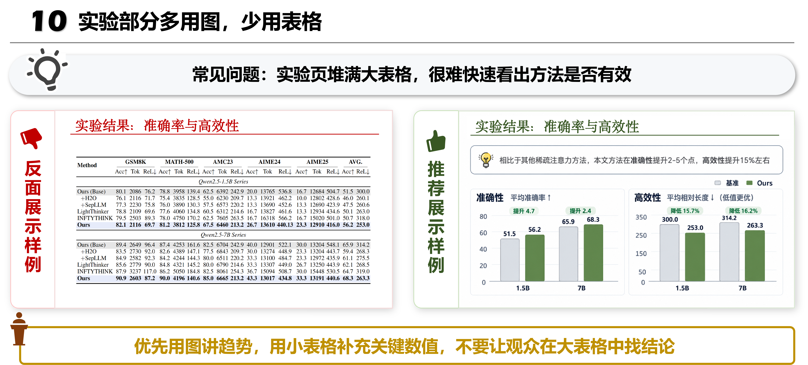
</p>

</details>

<p align="right"><a href="#-presentation-tips">⬆️ 返回 Tips 目录</a></p>

---

<a id="summary-closing"></a>

### 🎯 总结收尾

<blockquote>
聚焦如何在汇报结束时重新强化任务、方法、实验结果与核心结论，让听众带着最重要的信息离场。
</blockquote>

<br/>

<details open>
<summary><b>Tip 11: 在总结页回顾核心内容，强化最后印象</b></summary>

<br/>

<p align="center">
  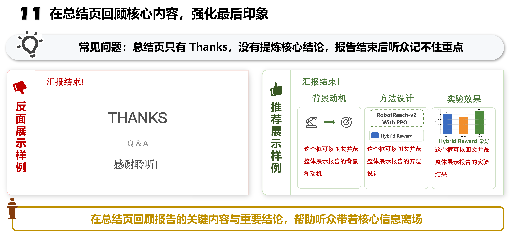
</p>

</details>

<p align="right"><a href="#-presentation-tips">⬆️ 返回 Tips 目录</a></p>

---

## 📖 资源合集

> 持续整理与 Research Presentation、Academic Talk 和科研 PPT 设计相关的优秀资料。

### 🇨🇳 中文经验

<div align="center">

| # | 资源 | 来源 |
|:---:|:---|:---:|
| 1 | TBD | TBD |
| 2 | TBD | TBD |
| 3 | TBD | TBD |

</div>

### 🎬 视频 / 课程资源

<div align="center">

| # | 资源 | 说明 |
|:---:|:---|:---|
| 1 | TBD | TBD |
| 2 | TBD | TBD |
| 3 | TBD | TBD |

</div>

### 🌍 英文经验

<div align="center">

| # | 资源 | 作者 / 来源 |
|:---:|:---|:---:|
| 1 | TBD | TBD |
| 2 | TBD | TBD |
| 3 | TBD | TBD |

</div>

### 🛠️ 工具、工作流与相关项目

<div align="center">

| # | 项目 | 简介 |
|:---:|:---|:---|
| 1 | TBD | TBD |
| 2 | TBD | TBD |
| 3 | TBD | TBD |

</div>


---


## 👥 组织者列表

<p align="left">
  <b>感谢以下成员对本项目进行组织、维护与内容整理</b>
</p>

<p align="left">
  <a href="https://github.com/qinlibo-hit">
    </a>
  &nbsp;&nbsp;
  <a href="https://github.com/lishasha2001">
    </a>
  &nbsp;&nbsp;
  <a href="https://github.com/Tenkachaya">
    </a>
</p>

---

## 🤝 欢迎贡献

欢迎通过 **Issue** 或 **PR** 补充更多 Research Presentation Tips、真实的 Bad / Good Slide 示例以及相关资源。

我们尤其欢迎以下类型的贡献：

- 💡 新的 Research Presentation Tips
- 🖼️ Bad Slide / Good Slide 对比案例
- 📊 更清晰的实验结果展示方式
- 🧩 方法、公式与模型结构的讲解案例
- 🎤 优秀的 Academic Talk / Conference Presentation
- 📚 与科研汇报相关的文章、课程和学习资源
- ✏️ 对现有 Tips 的修改与补充

<details>
<summary><b>📝 建议新增内容时保持以下结构</b></summary>

<br/>

```text
<Tip 标题>

常见问题：...

❌ Bad Slide：...

✅ Good Slide：...

💡 Core Principle：...
```

</details>

科研汇报本身没有唯一正确的模板。我们希望这个项目能够不断汇集不同研究者的实践经验，帮助大家用更清晰、更有效的方式表达自己的研究。

---

## 🙏 Acknowledgements

本项目在组织形式与内容呈现上参考了：

- [Paper-Rebuttal-Tips](https://github.com/MLNLP-World/Paper-Rebuttal-Tips) — 面向学术论文 Rebuttal 的经验总结与实践指南

感谢所有为科研写作、学术交流与 Research Presentation 分享经验的研究者和社区贡献者。
